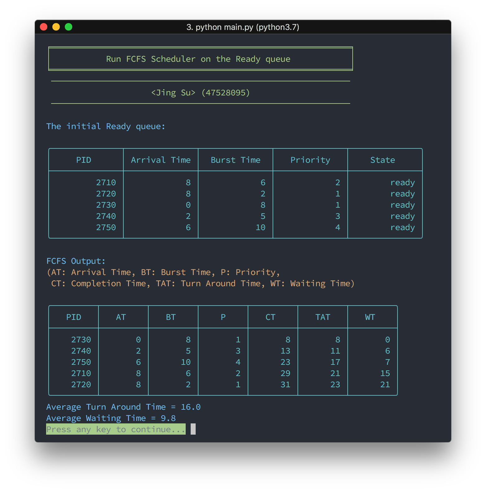
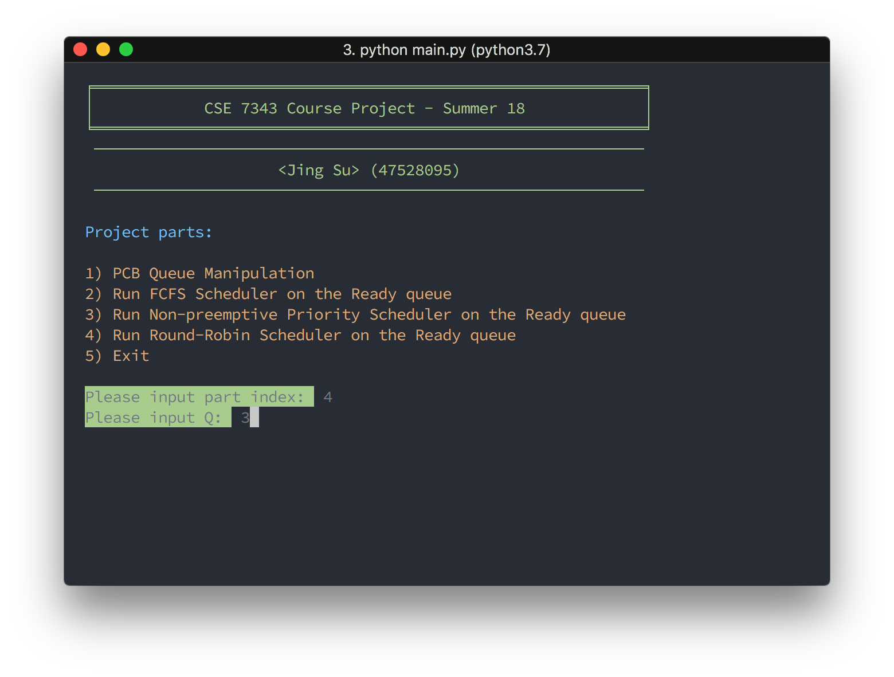
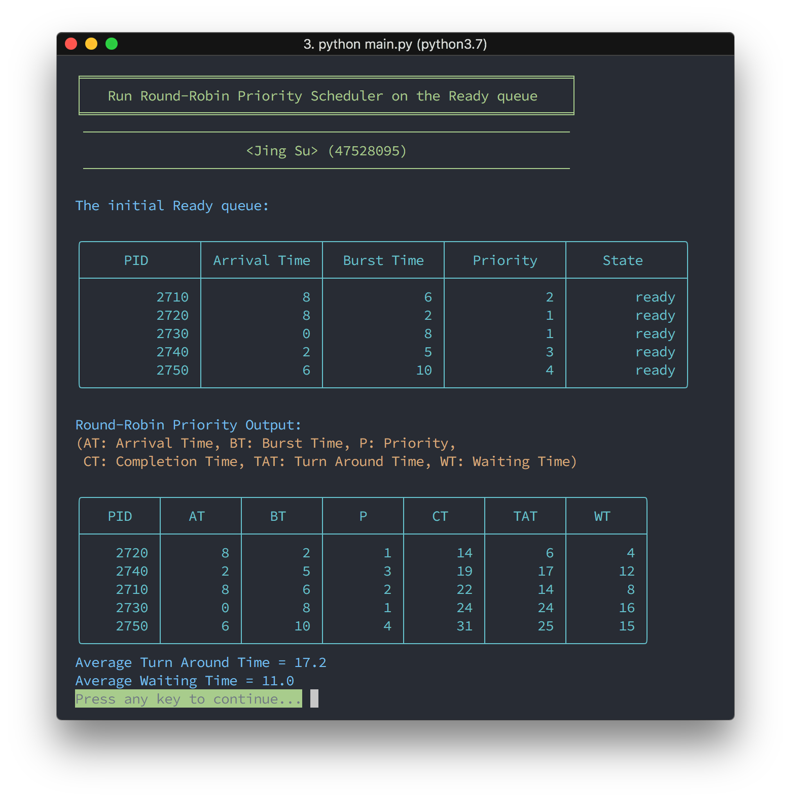

# CSE 7343 Course Project - Summer 18
###### *Jing Su*

> This PDF file is generate by MarkDown, the corresponding source file is `README.md`. Since this report contains many screenshots with plain text, for better view experience, please view the GitHub rendered page in this link:
> [https://github.com/ai0/CSE7343_Project/blob/master/README.md](https://github.com/ai0/CSE7343_Project/blob/master/README.md)
> Besides, the rendered html file under the same folder is also a better choice.

### Dependencies
* Python 3.5+
* [tableprint](https://github.com/nirum/tableprint) (Handy console printing tabular data)

### Execution
#### Using pyenv:
```sh
pyenv virtualenv 3.7.0 cse7343-env
python main.py
```
#### Using system:
```sh
pip3 install -r requirements.txt
python3 main.py
```

#### Interface


### Part 1 - PCB


This part implemented a PCBQueue based on  doubly linked list. The linked list contains PCB. The PCB data structure used a class with (pid, arrival_time, burst_time, priority, state, remaining_time) properties. The PCBQueue has a cache to store all process PIDs in this queue to improve search performance and ensure no processes with the same PID exist.

For the finding, loop over the linked list by pointer and compare the linked list node PID to target PID, return the found node or none.

For the adding, first check is this queue empty, if empty then write data to tail pointer. Otherwise find the target insert position first, then insert the PCB to the linked list corresponding position.

For deleting and inspecting, first find the target node, then remove the node from linked list and remove the PID from queue cache or display the node data in table format.

This part code is implemented in `pcb.py` file.

#### Execution Trace Screenshot


### Part 2 - Schedulers

For the FCFS scheduler, the processes are  first come, first served. While the ready queue has PCB, traverse the queue and find the earliest arrive process, then run this process and calculate time cost.



For the Non-preemptive Priority scheduler, while the ready queue has PCB, traverse the queue and find the highest priority process, processes with the same priority are executed on first come first served basis. If multiple processes have the same highest priority, then run this process which has the  earliest arrival time and calculate time cost.


For the Round-Robin scheduler, each process is assigned a fixed time slot (q) in a cyclic way. First ask for input the parameter q. While the ready queue has PCB, loop over the queue by arrival time order, check if the current process remaining time less than or equal to the q which means the process is finish its work, and calculate time cost.




This part code is implemented in `scheduler.py` file.

#### Compare using the sample input data

##### FCFS Scheduler

| PID | Arrival Time | Burst Time | Priority | Completion Time | Turn Around Time | Waiting Time |
| :-: | :-: | :-: | :-: | :-: | :-: | :-: |
| 2710 | 8 | 6 | 2 | 29 | 21 | 15 |
| 2720 | 8 | 2 | 1 | 31 | 23 | 21 |
| 2730 | 0 | 8 | 1 | 8 | 8 | 0 |
| 2740 | 2 | 5 | 3 | 13 | 11 | 6 |
| 2750 | 6 | 10 | 4 | 23 | 17 | 7 |

Average Turn Around Time = 16.0
Average Waiting Time = 9.8

#### Non-preemptive Priority Scheduler

| PID | Arrival Time | Burst Time | Priority | Completion Time | Turn Around Time | Waiting Time |
| :-: | :-: | :-: | :-: | :-: | :-: | :-: |
| 2710 | 8 | 6 | 2 | 16 | 8 | 2 |
| 2720 | 8 | 2 | 1 | 10 | 2 | 0 |
| 2730 | 0 | 8 | 1 | 8 | 8 | 0 |
| 2740 | 2 | 5 | 3 | 21 | 19 | 14 |
| 2750 | 6 | 10 | 4 | 31 | 25 | 15 |

Average Turn Around Time = 12.4
Average Waiting Time = 6.2

#### Round-Robin Scheduler with q=3

| PID | Arrival Time | Burst Time | Priority | Completion Time | Turn Around Time | Waiting Time |
| :-: | :-: | :-: | :-: | :-: | :-: | :-: |
| 2710 | 8 | 6 | 2 | 22 | 14 | 8 |
| 2720 | 8 | 2 | 1 | 14 | 6 | 4 |
| 2730 | 0 | 8 | 1 | 24 | 24 | 16 |
| 2740 | 2 | 5 | 3 | 19 | 17 | 12 |
| 2750 | 6 | 10 | 4 | 31 | 25 | 15 |

Average Turn Around Time = 17.2
Average Waiting Time = 11.0

### Programming Environment
**OS:**         macOS 10.13.5
**Hardware:**   MacBook Pro
**Software:**
* **Language:** Python 3.7.0 (pyenv)
* **Editor:**   VIM 8.1
* **Terminal:** iTerm2 + zsh