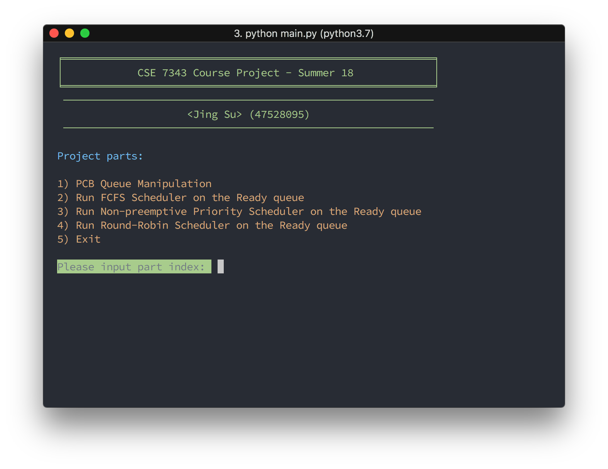
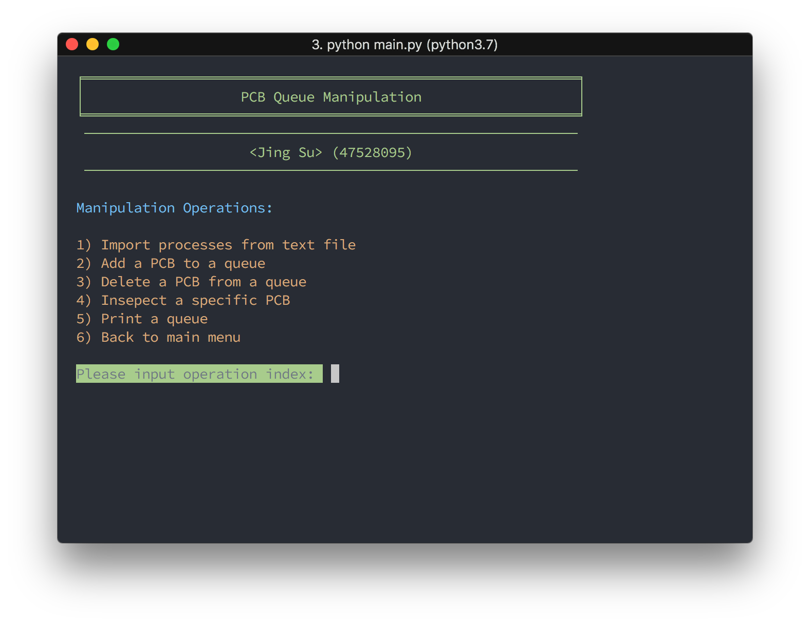
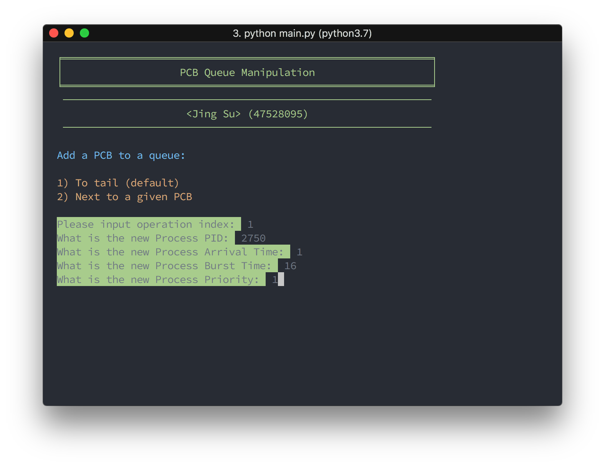
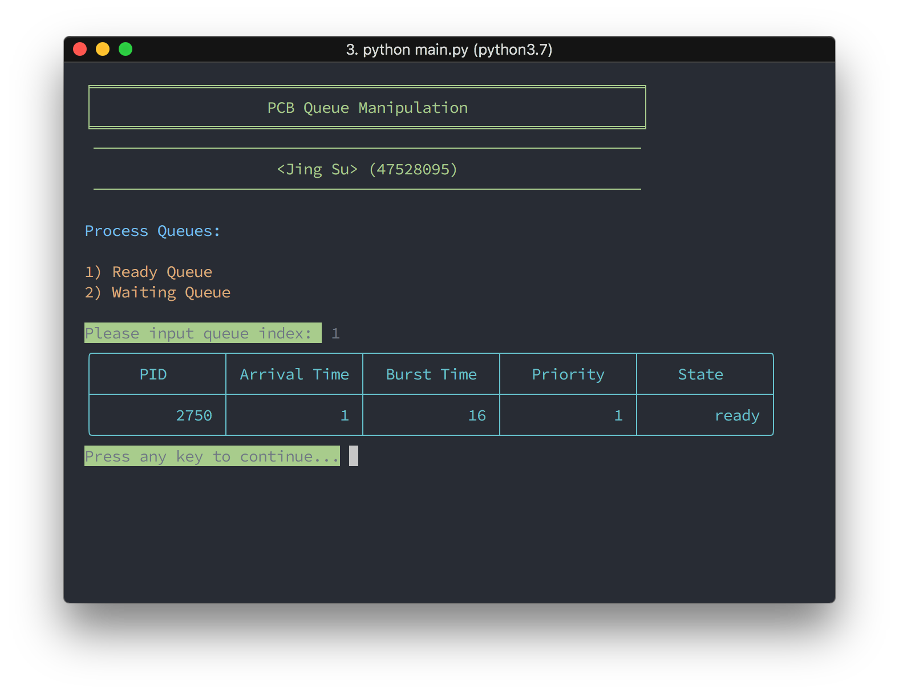
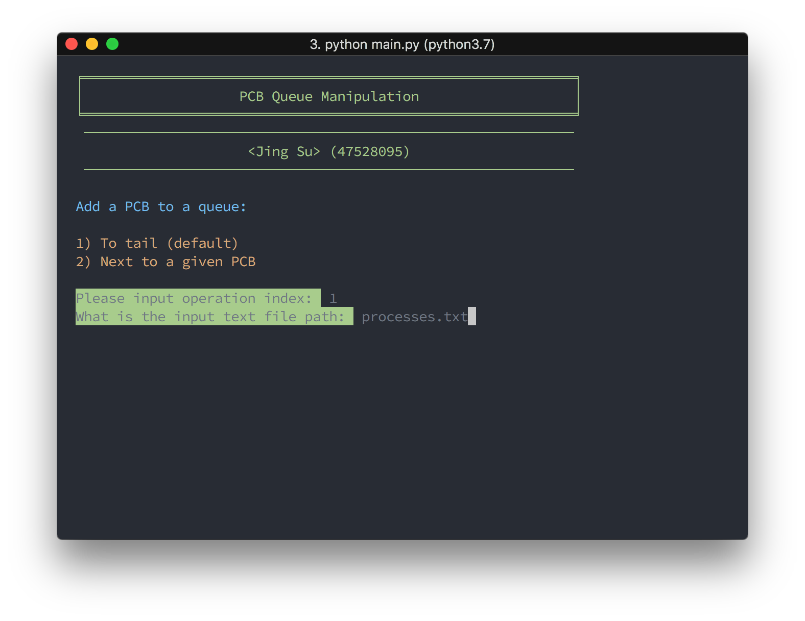
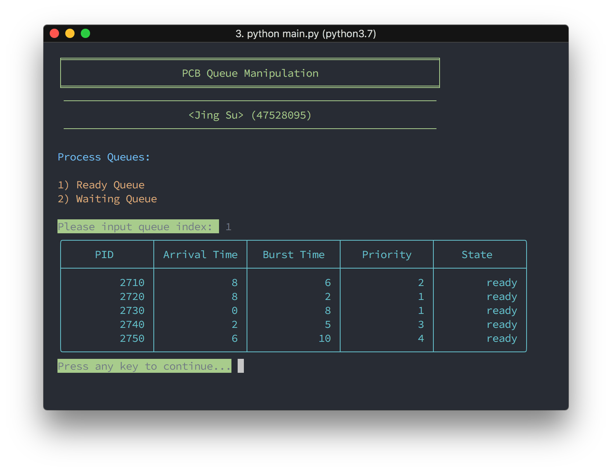

# CSE 7343 Course Project - Summer 18
###### *Jing Su*

> This PDF file is generate by MarkDown, the source file is README.md. Since this report contains many screenshots with plain text, for better view experience, please view the GitHub rendered page in this link:

### Dependencies
* Python 3.5+
* [tableprint](https://github.com/nirum/tableprint) (Handy console printing tabular data)

### Execution
#### Using pyenv:
```sh
pyenv virtualenv 3.7.0 cse7343-env
python main.py
```
#### Using system:
```sh
pip3 install -r requirements.txt
python3 main.py
```

#### Interface


### Part 1 - PCB


This part implemented a PCBQueue based on  doubly linked list. The linked list contains PCB. The PCB data structure used a class with (pid, arrival_time, burst_time, priority, state) properties. The PCBQueue has a cache to store all process PIDs in this queue to improve search performance and ensure no processes with the same PID exist.

For the finding, loop over the linked list by pointer and compare the linked list node PID to target PID, return the found node or none.

For the adding, first check is this queue empty, if empty then write data to tail pointer. Otherwise find the target insert position first, then insert the PCB to the linked list corresponding position.

For deleting and inspecting, first find the target node, then remove the node from linked list and remove the PID from queue cache or display the node data in table format.

#### Execution Trace Screenshot






### Part 2 - Schedulers


### Programming Environment
**OS:**         macOS 10.13.5
**Hardware:**   MacBook Pro
**Software:**
* **Language:** Python 3.7.0 (pyenv)
* **Editor:**   VIM 8.1
* **Terminal:** iTerm2 + zsh